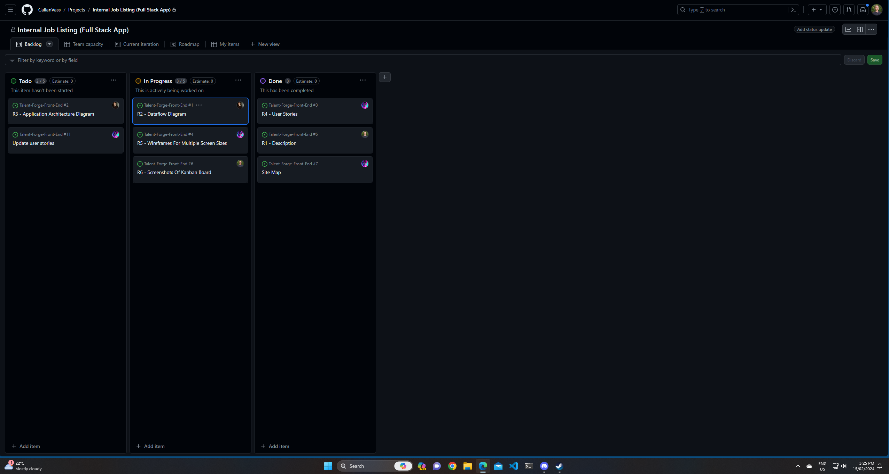

# Internal-Hiring-App-Front-End

## Table Of Contents:

- [Website Description](#r1---website-description)
- [Dataflow Diagram](#r2---dataflow-diagram)
- [Application Architecture Diagram](#r3---application-architecture-diagram)
- [User Stories](#r3---application-architecture-diagram)
- [Wireframes](#r5---wireframes)
- [Kanban Screenshots](#r6---kanban-screenshots)
- [Revised Changes](#revised-changes)
- [Bibliography](#bibliography)

### R1 - Website Description

### Purpose

The purpose of TalentForge is to provide a space for organisations and companies to advertise their positions internally before displaying them on job-listing websites. By providing this functionality, we're able to give employees a chance to display their ambitions. This works for the employer by lessening the costs (both time-wise and monetarily) associated with the hiring process, and for the employee by providing them a place to display their interest and ambition for a company position.

### Functionality / Features

#### Sitemap

The main functionality of TalentForge is the ability to list jobs internally, however the web app consists of five different pages, each possessing a different function/feature. The features go as follows:

- Login Feature:

This will allow Users to login to the application. It will check usernames and passwords (hashed using bcrypt and Mongoose schema) against a MongoDB database. If the username and password do not match / are incorrect, the API will deny them access to the homepage and prompt the user to try again.

- Profile Feature:

Each user will have a profile page they can visit to update their information. Users will be encouraged to update their profile beyond the bare essentials admins will have to enter upon account creation. It will contain the following sections: Name, Contact Info, Bio, Current Role, Skills, Career Plan, and potentially Resume. This way when the user applies to a job, the information can be taken directly from their profile, making the entire process as simple as a click.

- Job Search Feature:

Users will be able to search for jobs within their companies (separated by department). This will help users speedily navigate their job search.

- Job Listing Feature:

Admins have access to this feature, which will allow them to list company jobs on the site itself. Jobs will have a listing title along with a department, description, salary, expectations, close date.

- User Search Feature:

Admins will be able to search users via a search feature. This might be to affirm contact details or update details of the user upon acceptance of the new job.

- Account Creation Feature:

This will allow admins to create accounts for users (employees) or other admin users. This priveledge will only be granted to admins so as to prevent standard users from creating accounts. Admins will have to enter a few essential details about the user before account creation, such as: Name, Email, Department, Job Title.

**(Strictly Nice To Have)**

- Training Opportunities Feature:

This feature will be accessible via the Training page and will allow all users to view upcoming training / upskilling opportunities they might be interested in. Admins will be responsible for adding the opportunities.

- Training Booking Feature:

Upon clicking the training opportunity, users will be able to register their interest for an event. Upon deletion of the listing, all accumulative data will be deleted too.

- Events Page Feature:

This feature will be viewable under the Events page and will show users company updates to keep them informed, conferences, and guest speaker sessions users can also register their interest for.

### Target Audience

The target audience for TalentForge will be employers looking to promote employees from within their own company before they search for talent outside of their current pool.

### Tech Stack

Our team will be completing this project using the MERN stack, as outlined below.

**MongoDB**

A non-relational database with a focus on flexibility and scalability, is used to store and retrieve data for web applications. MongoDB stores data as BSON (a binary representation of JSON) in object-like *documents* that contain key-value pairs. MongoDB is also an agnostic database, in that it is compatible across many different technologies. Inside of MongoDB, we will be using Mongoose as our ORM (Object Data Model) library, using hooks, schema validation, and models to interact with our back-end API.

**Express.js**

Express is a minimal web-application framework that uses JavaScript to help developers create server-side applications, API's, and web applications. We will be using Express to create our API for TalentForge using its routing capablities and middleware. Express will also connect directly to our Mongo database.

**React.js**

React is an open source, front-end framework which uses JavaScript to help developers create interactive applications by harnessing the power of HTML, CSS, and JSX (JavaScript + XML). React makes it easy to create SPAs (single-page applications), which conditionally render a webpage for the user by adding and removing its moving parts dynamically. It also uses a virtual DOM in a process known as reconciliation to improve performance speed. 

**Node.js**

Node is a back-end runtime environment that allows developers to write server-side applications in JavaScript. Built with Google Chrome's V8 JavaScript engine, node is suitable for real-time applications and intergration with other technologies. We will use Node as our server-side environment, hosting the Express app which will respond to API calls. We will also use NPM (Node Package Manager) to install dependencies for our application including:

*bcrypt* - To hash user passwords so they aren't stored in plain text in our database

*cors* - Simple middleware to enable CORS requests for specific urls (or all for development)

*dotenv* - For storing sensitive environment variables without having to commit them to the repo

*jsonwebtoken* - For returning JSON Web Tokens to app users for session security and timeout purposes

### R2 - Dataflow Diagram
#### Dataflow Diagram Keys: 
The following image shows the keys for the dataflow diagram;
 - The red rectangle represents the external entity AKA the end user
 - The green rectangle represents the documents inside a collection, in the database
 - The yellow oval represents a data process
 - The outbound arrow represents an ingoing or outgoing operation, this can be interpreted as CRUD in some cases

#### Diagram 1: Login Process & User Profile
This diagram shows the login process, with admin verification and moves on to the User Profile section. Here users can view, modify or delete their own profile. This serves the purpose of preparing their profile for job applications.

#### Diagram 2: Login Process & Job Listings
This diagram shows the login process, with admin verification and moves on to the Opportunities/Job Listings section. Users can search for job listings, as well as view or apply for said listings. Admin are able to access the job listings and make modifications (adding, removing, updating etc). This serves the purpose of users accessing job listings and applying for the appropriate/suitable ones. It also serves the purpose of curating the listings database for admin.

#### Diagram 3: Login Process & Users (admin only)
This diagram shows the login process, with admin verification and moves on to the user section, this section is admin only and serves the purpose of adding, removing, and modifying users in the user document. 

### R3 - Application Architecture Diagram

To elaborate on the application architecture; 

- The end user interacts with the front end interface which is built with the following languages; Javascript (React), HTML, CSS, and XML. The front end also utlises Vite as a build tool and development server. 
- As users interact with the front end, the front end communicates with Express, a back end web application framework built for JavaScript (Node). Mongoose is used alongside Node as an Object Data Modeling library which communicates with the database (Mongo.db). 
- The database consists of collections, which contain documents and in this application, the respective documents are categorised into Users (including User Profiles), and Job Listings. Between the front and back end are API calls and requests, and between the back end and database are data queries and responses. 

The combination of communication between these tools and technologies result in a full stack MERN application architecture. 

### R4 - User Stories
User stories are an important part of agile software development. They provide a general explanation of the purpose of a particular feature from the perspective of the user. This ensures the end user is the focus and gives context to the development team on what they are building, what it needs to deliver and the value it will add for the user.

Having interviewed team members about their needs/expectations, the user stories are told from the perspectives of Luke (general user), Alex (manager) and Heather (HR team leader/admin):

* As Luke, I want to create a profile that shows off my skills and where I can talk about my current role and career plan, to highlight my achievements and goals to others within the company
* As Luke, I want to be able to search and apply for other opportunities within the organisation, so that I can broaden my knowledge and experience
* As Luke, I want to search for other users in the organisation, so that I can see their skills and experience
* **REVISION** As Luke, I would like to see any roles I've applied for, but if other people search my profile, that information should be private and therefore only visible to me (*added this point after completing the wireframes as it became apparent that users wouldn't want their applications to be publicly accessible*)
* As Alex, I want to be able to post vacancies within my team, as the preference is always to fill roles internally if possible, and give users the opportunity to apply directly in the app
* **REVISION** As Alex, when creating job listings, I'd like some standard features to have a tick box type selection (e.g. full time/part time) to make it quicker and easier to create the listing (*this feature has been incorporated into the wireframe - radio buttons allow job type/location of work etc to be selected*)
* **REVISION** As Alex, when creating job listings, it would be nice to be able to save it as a draft, without it being published straight away, that way if the job hasn't been signed off yet or I'm waiting for confirmation on something, I could get things ready and then simply update it to 'final' when it's ready (*added 'Active on site' on/off slider to the job listing wireframe so that the creator can create, update etc but leave the slider set to off until they are ready for it to be live*)
* As Alex, I want to be see a list of any users who have applied for a role, to begin the process of next steps
* As Heather, I want to set up new users, so that new team members joining the business have access to this resource 
* **REVISION** As Heather, I think it's important for users who are applying for roles to indicate they have spoken with and received the consent of their line manager to apply, so that team members are aware that this process must be followed. (*Added a tick box to the job application page - the 'send' button should be disabled until this box is ticked*)
* As Heather, I want to remove users’ profiles once they’ve left the business so that their profile no longer appears in any search results
* As Heather & Alex, we want to be able to change the job roles or departments of team members, to keep their details up to date when department moves or promotions occur  

**REVISION**: After some discussions we decided that for the initial version of the app, there will only be two types of users: admin / non-admin. Managers (who are able to create/manage job listings) will have the same privileges as admin (who are able to create/delete users and re-set passwords etc). Therefore, although the needs of Heather and Alex are different, initially these two types of user will have the same access.

#### Additional (nice to have) features:
* As Luke, I want to be able to search for training sessions and learning opportunities, so that I can broaden my skill set
* As Alex, I want to be able to see an overview of skills within my team, to identify training needs and opportunities
* As Heather, I’d like to be able to set up training sessions and other internal events, so that individuals within the company can take advantage of learning opportunities
* As Heather, I want users to be able to register for training sessions/events, as some of these will be in-person events where numbers are limited

### R5 - Wireframes

---
#### Visual Sitemap

### R6 - Kanban Screenshots

Kanban Screenshots:

For tracking our TalentForge documentation tasks, we've chosen to use use GitHub Projects, which acts much like Trello with its carded/ticketed system for asigning tasks and indicating their current state. This was to keep our work centralised on the one platform and to avoid unnecessary navigation.

 

### Revised Changes:

The sitemap created originally contained all features in full colour, however after revising this approach, the additional features were changed to grey to represent possible implementation rather than guaranteed.

- Original Sitemap

- Updated Sitemap

The application architecture diagram has also undergone changes, adding a higher level of detail surrounding the explanations of frameworks/programming languages for the front-end, back-end, and database.

- Original Application Architecture Diagram

- Updated Application Architecture Diagram

The user stories issue underwent changes when another issue was created to indicate the user stories necessitated revision. The details of these changes can be found above in the User Stories section.

- Original Kanban Screenshots (User Stories):

- Updated Kanban Screenshots (User Stories)

### Bibliography

- Atlassian n.d., Git Push | Atlassian Git Tutorial, Atlassian, viewed 13 February 2024, [Link](https://www.atlassian.com/git/tutorials/syncing/git-push)

- Creating a pull request n.d., GitHub Docs, viewed 13 February 2024, [Link](https://docs.github.com/en/pull-requests/collaborating-with-pull-requests/proposing-changes-to-your-work-with-pull-requests/creating-a-pull-request)

- Documents — MongoDB Manual n.d., https://github.com/mongodb/docs-bi-connector/blob/DOCSP-3279/source/index.txt, viewed 14 February 2024, [Link](https://www.mongodb.com/docs/manual/core/document/)

- Ed Discussion n.d., edstem.org, viewed 14 February 2024, [Link](https://edstem.org/au/courses/13831/lessons/41823/slides/288674)

- Farkas, M 2023, martonfarkas/BookSwapU, GitHub, viewed 15 February 2024, [Link](https://github.com/martonfarkas/BookSwapU)

- Gillis, A n.d., What is MongoDB? A definition from WhatIs.com, SearchDataManagement, viewed 14 February 2024, [Link](https://www.techtarget.com/searchdatamanagement/definition/MongoDB)

- Node.js Tutorial 2019, W3schools.com, viewed 14 February 2024, [Link](https://www.w3schools.com/nodejs/)

- OpenJS Foundation 2017, Express - Node.js web application framework, Expressjs.com, viewed 14 February 2024, [Link](https://expressjs.com/)

- Peterson, L 2023, LachlanPeterson/TST-FullStack_Application, GitHub, viewed 15 February 2024, [Link](https://github.com/LachlanPeterson/TST-FullStack_Application)

- Rehkopf, M 2019, User Stories | Atlassian, Atlassian, Atlassian, viewed 13 February 2024, [Link](https://www.atlassian.com/agile/project-management/user-stories)

- Vlaeva, S 2021, MongoDB & Mongoose: Compatibility and Comparison | MongoDB, www.mongodb.com, viewed 14 February 2024, [Link](https://www.mongodb.com/developer/languages/javascript/mongoose-versus-nodejs-driver/)
